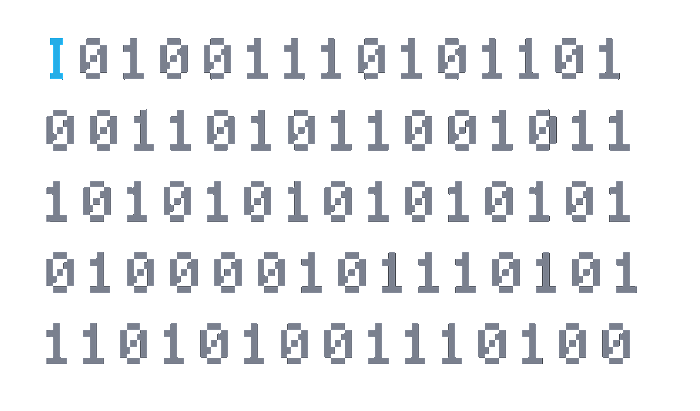

<h1 align="center">Basic code Injection</h1>
<h4 align="center">Basic code injection that makes the target process jump to other function.</h4>
<p align="center"></p>

<h3>1.-Introduction</h3>
I've been always interested in game modding and how people can modify them  in spite of not having the source code, so I wanted to have a first view of how they do it.

<p>for this case we will need <a href="mainCode">two things</a>: 
<ol>
  <li>the target (which we will code in order to not having legal issues).:sweat_smile:</li>
  <li>the injector, that will modify the target.</li>
</ol>

  In real life we sometimes won't have access to the source code, so we will just prentend that we only have the compiled version of the target, anyway, you can find the target code <a href="targetCode">here</a>.
  the target program is just a calculator that can only make the two next operations:
```bash
>./target
> 2*3
6
> 2+3
5
```
</p>

<h3>2.-Finding the instruction we want to modify</h3>
<p>
  The first step to find the address is disassembling the target, I will use Eclipse.
  To disassemble the code the first thing we need is the pid of the process. So my injector will use <b>vfork</b> to create a subprocess and then will run the target in the child with the <b>execv</b> function. <b>vfork</b> will return the child pid to the parent.
  So now we have two process running:
  <ul>
    <le> <b>The target</b> as the child.</le>
    <le> <b>The injector code</b> with the target pid as the parent.</le>
  </ul>

there is a lot of options to watch the disassembly, what I do is stopping the debug session when the target pid is generated and then <b>connect</b> the process to the debugger so I can  inspect step by step the target.
Once you have the pid, you can open the pseudofile "/proc/yourpid/maps" to see the target base adress. after some research, I realized that the first number of the second line points to the "init" tag of the disassembly code.

So to know the running address of the target instruction we just need to get the offset of the target instruction from the init address and then add it to the running init address.
<h3>3.-Making target jump to other address</h3>
